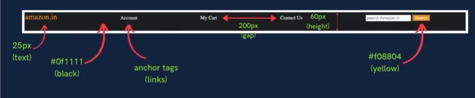

## 🚀 Practice Set 3

---

### Q1:
**Create a div with height & width of 100px.**  
Set its background color to green & the border radius to 50%.
Extra bonus: make traffic light signal drawing.
---

### Q2:
**Create the following navbar:**
