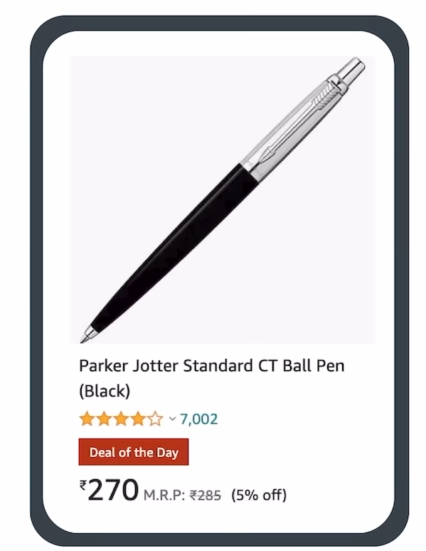

*Practice Problem statement*

1. Create a const object called "product" to store information shown in the picture below:

2. Create a const object called "profile" to store information storing information in the picture below:
